#### Compound Procedures

计算平方数


两种展开计算方式

有以下定义的过程：

```scheme
(define (square x) (* x x))

(define (sum-of-squares x y) 
  (+ (square x) (square y)))

(define (f a)
  (sum-of-squares (+ a 1) (* a 2)))
```

对于计算 `f(5)` 有两种计算方式:

1. 将参数相应的带入计算 (***applicative-order***)

   ```bash
   f(5)
   (sum-of-squares (+ 5 1) (* 5 2))
   (+ (square 6) (square 10))
   (+ 36 100)
   136
   ```

2. 带入参数，直到需要计算它的值 (***normal-order***)

   ```bash
   f(5)
   (sum-of-squares (+ 5 1) (* 5 2))
   (+ (square (+ 5 1)) (square (* 5 2)))
   (+ (* (+ 5 1) (+ 5 1)) (* (* 5 2) (* 5 2)))
   (+ (* 6 6) (* 10 10))
   (+ 36 100)
   136
   ```

***Lisp use applicative-order evaluation***

#### Conditional Expressions and Predicates

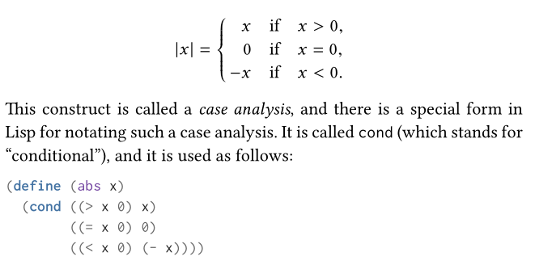

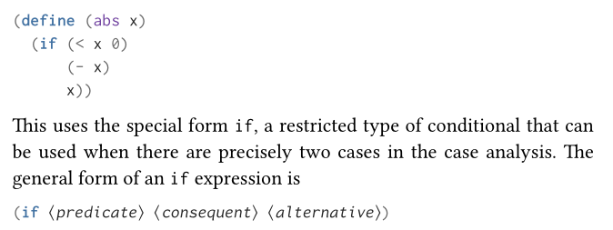

`if` 和 `cond` 不同的是， `if` 是一种特殊的形式，当它的 `predicate` 部分为真时， `then-clause` 分支会被求值，否则的话， `else-clause` 分支被求值，两个 `clause` 只有一个会被求值。

#### ***Lisp  operators are compound expressions***

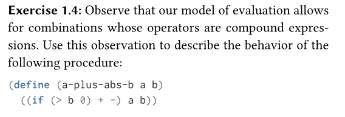

#### whether the interpreter useing applicative-order or normal-order

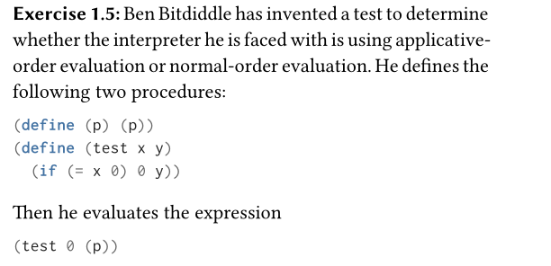

- 假设使用applicative order 

  ```scheme
  (test 0 (p))
  (test 0 (p))
  (test 0 (p))
  ......
  ; 将参数带入 (p) 计算导致一直循环
  ```

- 假设使用normal order

  ```scheme
  (test 0 (p))
  (test 0 (p))
  0
  ; 将参数带入，但是不会立即求其值，到需要计算时计算，所以(p)一直没有被计算
  ```

#### Newtod's Method

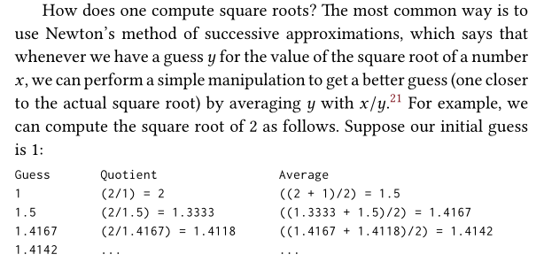

```scheme
; newton method
(define (sqrt x)
  (sqrt-iter 1.0 x))

(define (sqrt-iter guess x)
  (if (good-enougth? guess x)
      guess
      (sqrt-iter (improve guess x) x)))

(define (improve guess x)
  (average guess (+ guess x)))

(define (average x y)
  (/ (+ x y) 2))

(define (good-enougth? guess x)
  (< (abs (- (square guess) x)) 0.001))
```

#### Internal definitions and block structure

块结构可以避免大型项目中，函数依赖混乱的问题

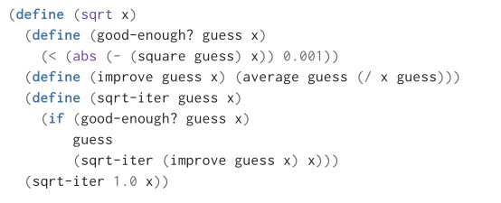

Internal definitions 可以进一步有优化块结构，`x` 是可以子结构公用的

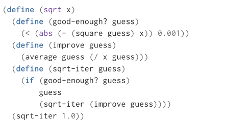

#### Linear Recursion and Iteration

考虑计算阶乘 `n!`:


$$
n! = n \times (n-1) \times (n-2) \dots 3 \times 2 \times 1
$$

- ***A linear recursive process***

  ```scheme
  (define (factorial n)
    (if (= n 1)
        1
        (* n (factorial (- n 1)))
     )
  )
  ```

  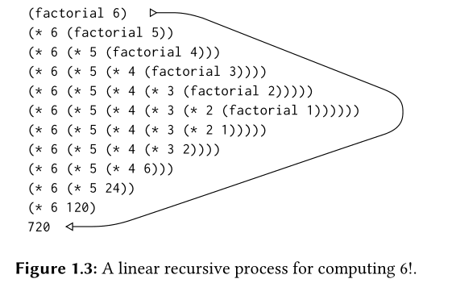


- ***A linear iterative process***

  ```scheme
  (define (factorial n)
    (define (fact-iter result count)
      (if (> count n)
          result
          (fact-iter (* result count) (+ count 1))
       )
     )
   )
  ```

  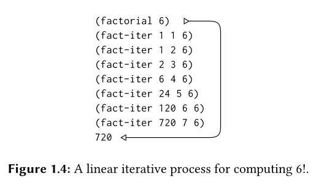

  #### Coin Change

  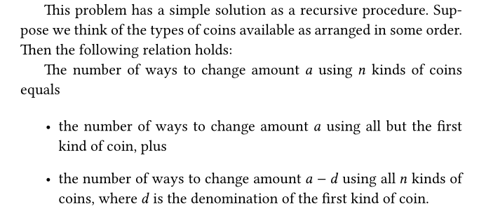

  如何理解上述的解法  $f(a, n) = f(a, n-1) + f(a-d, n)$ ，可以从`DFS`解决问题角度来理解。

  假设有零钱数量`a=15`, 硬币种类数为`n=5(1, 2, 5, 10 , 20)`, 如果使用 `DFS` 来解决这个问题，也即是，从硬币的种类数来遍历搜索，

  ```bash
  # 先从1开始遍历搜索
  (*1*, 2, 5, 10, 20)
  || # 继续向下搜索，直到和为a时停止搜索，计数加一
  (*1*, 2, 5, 10, 20) -> (1, *2*, 5, 10, 20) -> (1, 2, *5*, 10, 20) -> (1, 2, 5, *10*, 20) -> (1, 2, 5, 10, *20*)
  ||
  ......
  # 当1搜索完成时，开始从下一个2
  (1, *2*, 5, 10, 20)
  ||
  (1, *2*, 5, 10, 20) -> (1, 2, *5*, 10, 20) -> (1, 2, 5, *10*, 20) -> (1, 2, 5, 10, *20*)
  ||
  ......
  # 以此类推
  ```

  从遍历搜索的角度, $f (a, n-1)$  相当于 $f(15, 4(2, 5, 10, 25))$ 不使用1的所有组合数， $f(a-d, n)$  相当于 $f(14, 5(1, 2, 5, 10, 20))$ 使用1的所有组合数，所以两种组合为全部的组合数。

#### recursive ane iterative process

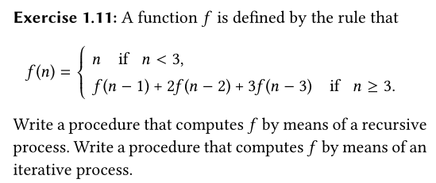

递归方法易得。

迭代的方法，推导如下：

```bash
f(3) = f(2) + 2f(1) + 3f(0)
f(4) = f(3) + 2f(2) + 3f(1)
f(5) = f(4) + 2f(3) + 3f(2)
....
```

所以可以看出，`f(4)` 与 `f(3)` 相关，有如下的推导

```bash
a, b, c => a+2b+3c, a, b => ..
```

代码如下:

```scheme
(define (func-iter n)
  (func-calc 2 1 0 0 n)
)

(define (func-calc a b c i n)
  (if (= i n)
      c
      (func-calc (+ a (* 2 b) (* 3 c))
                 a
                 b
                 (+ i 1)
                 n)
  )
)
```

####  Exercise 1.15 


代码为：

```scheme
(define (cube x) (* x x x))
(define (p x) (- (* 3 x) (* 4 (cube x))))
(define (sine angle)
   (if (not (> (abs angle) 0.1))
       angle
       (p (sine (/ angle 3.0)))))
```

问题为：


a问题易得，可以通过如下计算求解:

$\frac{12.15}{3} = 4.05, \frac{4.05}{3} = 1.35, \frac{1.35}{3} = 0.45, \frac{0.45}{3} = 0.15, \frac{0.15}{3}=0.05$

也就是 `5`次。

b问题，不易得，过程如下：

可以看出 `a` 值会不断被3除，直至其值小于 `0.1` ，由此可以得到 $\frac{a}{3^{n}} < 0.1$ ，则有:


$$
\frac{a}{0.1} < 3^{n}
$$

$$
log(\frac{a}{0.1}) < log(3^{n})
$$

$$
log(a)-log(0.1) < n log(3)
$$

$$
\frac{log(a)-log(1)}{log(3)} < n
$$

从公式可以看出，最后的时间复杂度也就是 $log(a)$。

#### Testing for Primality


也就是在  $0 < a < n$  的前提下，如果 `n` 为素数，则有  $a^{n} \bmod n = a \bmod n = a$  。

```scheme
; The Fermat test
(define (exptmod base exp m)
    (cond ((= exp 0) 1)
          
          ((isEven exp)
           (remainder
            (squre (exptmod base (/ exp 2) m))
            m))
          (else
           (remainder
            (* base (exptmod base (- exp 1) m))
            m))
    )
)

(define (fermat-test n)
    (define (try-it a)
        (= (exptmod a n n) a))
    (try-it (+ 1 (random (- n 1))))
)

(define (fast-prim n times)
    (cond ((= times 0) true)
          ((fermat-test n) (fast-prim n (- times 1)))
          (else false)
    )
)
```

#### Exercise 1.26

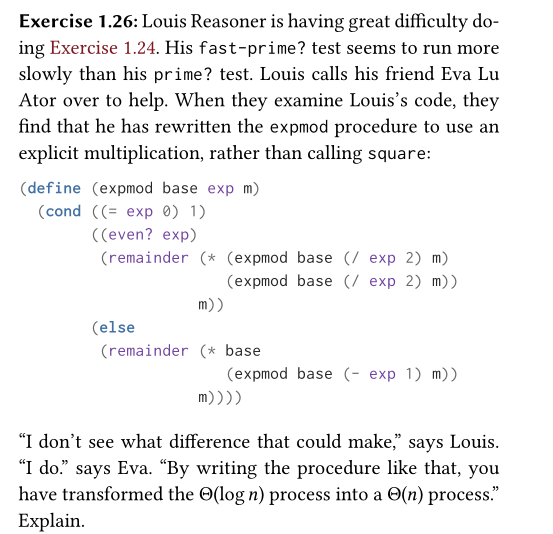

当 `exp` 为偶数时，上述程序会计算两次 `(expmod base (/ exp 2) m)`, 而 `(squre (expmod base (/ exp 2) m))` 只计算一次。

所以复杂度会上升如上写运行。

#### Miller–Rabin primality test

首先根据 `fermant's little theorem` 可以得到
$$
a^{n} \bmod n = a \bmod n = a \\
a^{n} \equiv a \pmod{n}
$$
如果`a` 不是 `n`的倍数，这个定理也可以写成更加常用的一种形式
$$
a^{n-1} \equiv 1 \pmod{n}
$$
假设 `p` 是奇素数，则 $x^{2} \equiv 1 (\bmod p)$ 的解为
$$
x^{2} - 1 \equiv 0 \pmod{p}
$$
也就是
$$
(x+1)(x-1) \bmod p = 0
$$
可以看出，要么 $(x+1)(x-1)=0$ 或者 $(x+1)(x-1)$ 为 `p` 的倍数，又结合费马小定理可以知道 $0<x<p$ ，故解为 $x=1, x=p-1$ 。

结合上述的到的 $a^{n-1} \equiv 1 \pmod{n}$, 则 $n-1$ 为偶数，如果 $n-1$ 为奇数， `n` 为偶数，则可以直接判断其能否被2整除，所以 $n-1$ 为偶数， 故:
$$
(a^{\frac{n-1}{2}})^{2} - 1 \equiv 0 \pmod{n}
$$
也就是, 判断 $a^{\frac{n-1}{2}}$ 的解是否为 `1 or n-1`，不为则不是素数，如果解正确，则要模仿之前的操作，再进行一轮检验，变成判断 $a^{\frac{n-1}{4}}$ ，直到最后变成奇数。


